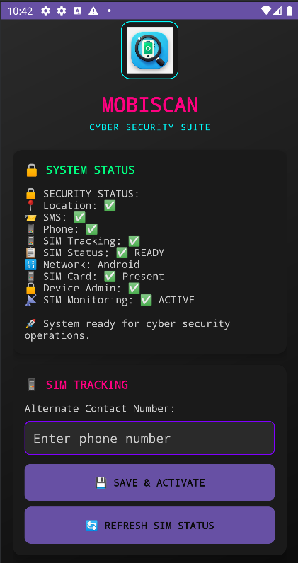
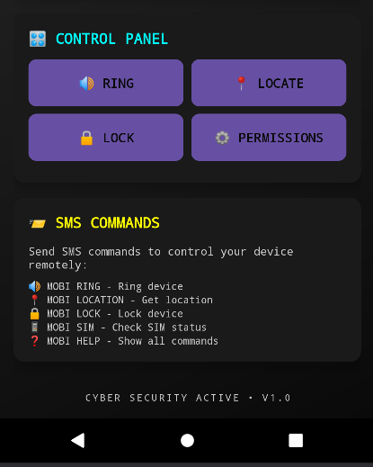
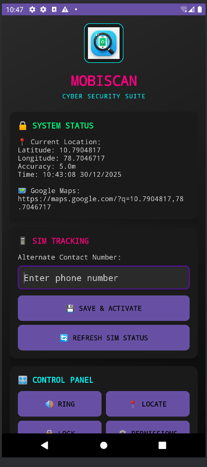

# Mobiscan - Mobile Security & Tracking App

A comprehensive Android application that provides mobile device security, location tracking, and SIM card monitoring capabilities.

## Screenshots

<div align="center">
  
  
  
  <p><i>Mobiscan Cyber Security Suite - System Status, SIM Tracking & Control Panel</i></p>
</div>

## Features

### 🔍 Location Services
- Get current device location with high accuracy
- Real-time GPS coordinates
- Google Maps integration
- Firebase location storage

### 📱 Phone Finder
- Remote SMS-triggered phone finder
- Loud alarm sound and vibration
- Works even when app is closed
- 30-second auto-stop timer

### 🔒 Device Security
- Remote device locking via SMS
- Device admin integration
- Emergency security features

### 📱 SIM Card Tracking (NEW!)
- **SIM Removal Detection**: Automatically detects when SIM card is removed
- **SIM Insertion Detection**: Detects when a new SIM card is inserted
- **SIM Change Detection**: Identifies when SIM card is replaced with a different one
- **Live Location Tracking**: Sends real-time location updates to alternate number
- **SMS Notifications**: Immediate alerts with device information and location
- **Continuous Monitoring**: Tracks location for 5 minutes after SIM change
- **Firebase Integration**: Stores all tracking data in Firebase database

## SIM Tracking Commands

### SMS Commands for SIM Status
Send these SMS commands to the device to check SIM status:
- `MOBI SIM` - Get current SIM card status
- `MOBI SIMSTATUS` - Check SIM card state
- `MOBI SIMINFO` - Get detailed SIM information
- `MOBI SIMCHECK` - Verify SIM card presence

### All Available SMS Commands
- **Ring Commands**: `MOBI RING`, `MOBI BUZZ`, `MOBI SOUND`, `MOBI ALARM`, `MOBI FINDME`
- **Location Commands**: `MOBI LOCATION`, `MOBI WHERE`, `MOBI LOCATE`, `MOBI GPS`, `MOBI TRACK`
- **Lock Commands**: `MOBI LOCK`, `MOBI SECURE`, `MOBI PROTECT`, `MOBI EMERGENCY`
- **SIM Commands**: `MOBI SIM`, `MOBI SIMSTATUS`, `MOBI SIMINFO`, `MOBI SIMCHECK`
- **Help Commands**: `MOBI HELP`, `MOBI COMMANDS`, `MOBI INFO`

## Setup Instructions

### 1. Permissions Required
The app requires the following permissions:
- **Location**: `ACCESS_FINE_LOCATION`, `ACCESS_COARSE_LOCATION`, `ACCESS_BACKGROUND_LOCATION`
- **SMS**: `RECEIVE_SMS`, `READ_SMS`, `SEND_SMS`
- **Phone**: `READ_PHONE_STATE`, `READ_PHONE_NUMBERS`
- **System**: `VIBRATE`, `WAKE_LOCK`, `FOREGROUND_SERVICE`

### 2. SIM Tracking Configuration
1. Open the app
2. Scroll to the "📱 SIM Tracking" section
3. Enter an alternate phone number (e.g., +1234567890)
4. Tap "💾 Save Alternate Number"
5. Grant all required permissions when prompted

### 3. Testing SIM Tracking
- Long press the "Save Alternate Number" button to test the tracking functionality
- This will simulate a SIM change and send test notifications

## How SIM Tracking Works

### Detection Process
1. **Boot Detection**: On device startup, the app records the current SIM state
2. **Continuous Monitoring**: The app monitors for SIM state changes in real-time
3. **Change Detection**: When a change is detected, the tracking service is activated

### Alert System
When a SIM change is detected:
1. **Immediate Notification**: Sends SMS with device info and change type
2. **Location Tracking**: Starts continuous location monitoring for 5 minutes
3. **Periodic Updates**: Sends location updates every 30 seconds
4. **Firebase Storage**: All data is stored in Firebase for later analysis

### SMS Alert Format
```
🚨 SIM CARD REMOVED ALERT 🚨

📱 Device: Samsung Galaxy S21
📅 Time: 14:30:25 15/12/2024
🔄 Change: REMOVED
📋 SIM State: ABSENT
🔢 SIM Serial: 12345678...

📍 Getting location...
```

### Location Update Format
```
📍 LIVE LOCATION UPDATE

🚨 SIM REMOVED detected
📱 Device: Samsung Galaxy S21
📅 Time: 14:30:55 15/12/2024
📍 Coordinates: 40.7128, -74.0060
🎯 Accuracy: 5m
🗺️ Map: https://maps.google.com/?q=40.7128,-74.0060

🔄 Tracking active...
```

## Technical Implementation

### Components
- **SimChangeReceiver**: Broadcast receiver for SIM state changes
- **SimTrackingService**: Foreground service for location tracking and SMS sending
- **MainActivity**: UI for configuration and testing
- **SmsReceiver**: Enhanced with SIM status commands

### Key Features
- **Foreground Service**: Ensures tracking continues even when app is backgrounded
- **Coroutines**: Efficient asynchronous location updates
- **Firebase Integration**: Real-time data storage and synchronization
- **Permission Handling**: Comprehensive permission management
- **Error Handling**: Robust error handling and logging

## Security Features

### Device Protection
- Remote device locking capability
- SIM change detection and alerting
- Location tracking for stolen devices
- Continuous monitoring system

### Data Privacy
- Local storage of alternate number
- Secure Firebase data transmission
- Minimal data collection
- User-controlled configuration

## Troubleshooting

### Common Issues
1. **SIM tracking not working**: Ensure all permissions are granted
2. **No SMS notifications**: Check SMS permissions and alternate number configuration
3. **Location not updating**: Verify location permissions and GPS settings
4. **Service not starting**: Check foreground service permissions

### Debug Information
- All activities are logged with detailed information
- Check logcat for "SimChangeReceiver" and "SimTrackingService" tags
- Firebase console shows all tracking data

## Requirements

- Android 7.0 (API 24) or higher
- Google Play Services
- Internet connection for Firebase
- SMS and phone permissions
- Location services enabled

## Privacy & Legal

This app is designed for legitimate device security and tracking purposes. Users are responsible for:
- Obtaining consent from device owners
- Complying with local laws and regulations
- Using the app only for authorized purposes
- Respecting privacy rights

## Support

For technical support or feature requests, please refer to the project documentation or contact the development team.

---

**Note**: This app is intended for legitimate security and tracking purposes only. Misuse of tracking features may violate privacy laws and regulations.
